# TCP/IP的十个问题

本文整理了一些TCP/IP协议族中需要必知必会的十大问题，既是面试的高频问题，也是程序员必备基础素养。

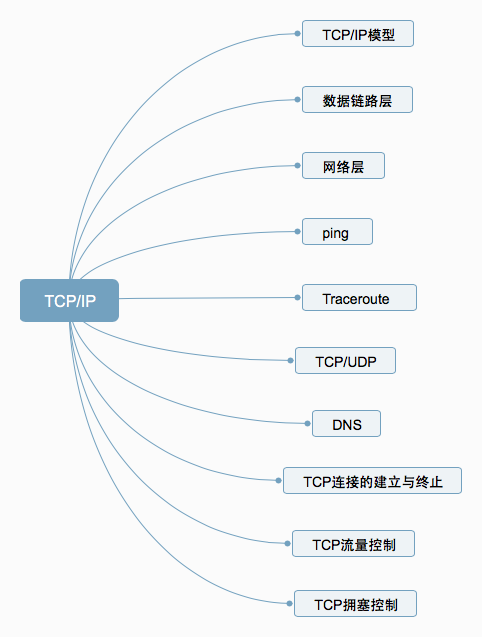

## 一、TCP/IP模型

TCP/IP协议模型（Transmission Control Protocol/Internet Protocol），包含了一系列构成互联网基础的网络协议，是Internet的核心协议。

基于TCP/IP的参考模型将协议分成四个层次，它们分别是**数据链路层、网络层、传输层和应用层**。下图表示OSI模型与TCP/IP模型各层的对照关系：

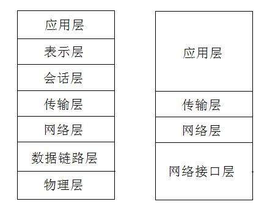

TCP/IP协议族按照层次由上到下，层层包装。

- 应用层，这里面有http，ftp等等我们熟悉的协议。

- 传输层，著名的TCP和UDP协议就在这个层次。

- 网络层，IP协议就在这里，它负责对数据加上IP地址和其他的数据以确定传输的目标。

- 数据链路层，这个层次为待传送的数据加入一个以太网协议头，并进行CRC编码，为最后的数据传输做准备。

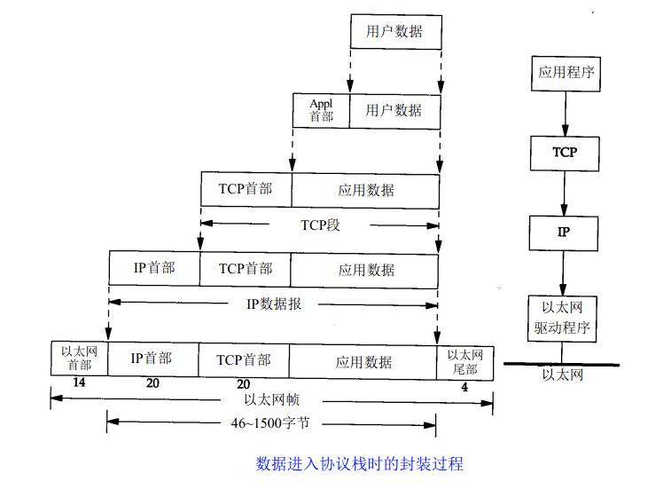

上图清楚地表示了TCP/IP协议中每个层的作用，而TCP/IP协议通信的过程其实就对应着**数据入栈与出栈的过程**。

- 入栈的过程，数据发送方每层不断地封装首部与尾部，添加一些传输的信息，确保能传输到目的地。
- 出栈的过程，数据接收方每层不断地拆除首部与尾部，得到最终传输的数据。

下图以HTTP协议为例，具体说明：

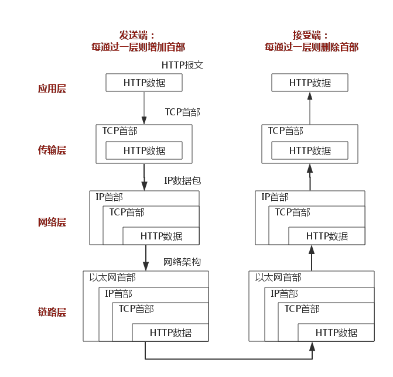

## 二、数据链路层

物理层负责0、1比特流与物理设备电压高低、光的闪灭之间的互换。
数据链路层负责将0、1序列划分为数据帧从一个节点传输到临近的另一个节点,这些节点是通过MAC来唯一标识的(MAC,物理地址，一个主机会有一个MAC地址)。

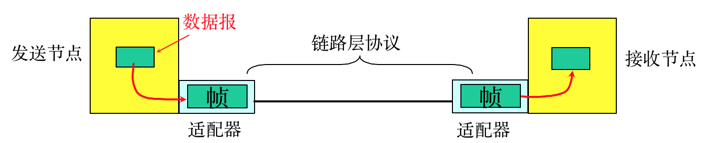

- 封装成帧: 把网络层数据报加头和尾，封装成帧,帧头中包括源MAC地址和目的MAC地址。
- 透明传输:零比特填充、转义字符。
- 可靠传输: 在出错率很低的链路上很少用，但是无线链路WLAN会保证可靠传输。
- 差错检测(CRC):接收者检测错误,如果发现差错，丢弃该帧。

## 三、网络层

### 3.1 IP协议

IP协议是TCP/IP协议的核心，所有的TCP，UDP，IMCP，IGMP的数据都以IP数据格式传输。要注意的是，IP不是可靠的协议，这是说，IP协议没有提供一种数据未传达以后的处理机制，这被认为是上层协议：TCP或UDP要做的事情。

#### 3.1.1 IP地址

在数据链路层中我们一般通过MAC地址来识别不同的节点，而在IP层我们也要有一个类似的地址标识，这就是IP地址。

**32位IP地址**分为**网络位和地址位**，这样做可以减少路由器中路由表记录的数目，有了网络地址，就可以限定拥有相同网络地址的终端都在同一个范围内，那么路由表只需要维护一条这个网络地址的方向，就可以找到相应的这些终端了。

```
A类IP地址: 0.0.0.0~127.0.0.0  
B类IP地址:128.0.0.1~191.255.0.0  
C类IP地址:192.168.0.0~239.255.255.0
```

#### 3.1.2 IP协议头

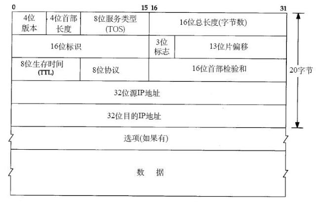

这里只介绍:八位的TTL字段。这个字段规定该数据包在穿过多少个路由之后才会被抛弃。某个IP数据包每穿过一个路由器，该数据包的TTL数值就会减少1，当该数据包的TTL成为零，它就会被自动抛弃。 
这个字段的最大值也就是255，也就是说一个协议包也就在路由器里面穿行255次就会被抛弃了，根据系统的不同，这个数字也不一样，一般是32或者是64。

### 3.2  ARP协议和RARP协议

ARP（地址解析）协议是**根据IP地址获取MAC地址**的一种解析协议，本来主机是完全不知道这个IP对应的是哪个主机的哪个接口，当主机要发送一个IP包的时候，会首先查一下自己的ARP高速缓存（就是一个IP-MAC地址对应表缓存）。

如果查询的IP－MAC值对不存在，那么主机就向网络发送一个ARP协议广播包，这个广播包里面就有待查询的IP地址，而直接收到这份广播的包的所有主机都会查询自己的IP地址，如果收到广播包的某一个主机发现自己符合条件，那么就准备好一个包含自己的MAC地址的ARP包传送给发送ARP广播的主机。

而广播主机拿到ARP包后会更新自己的ARP缓存（就是存放IP-MAC对应表的地方）。发送广播的主机就会用新的ARP缓存数据准备好数据链路层的的数据包发送工作。

RARP协议的工作与此相反，不做赘述。

### 3.3 ICMP协议

IP协议并不是一个可靠的协议，它不保证数据被送达，那么，自然的，保证数据送达的工作应该由其他的模块来完成。其中一个重要的模块就是ICMP(网络控制报文)协议。ICMP不是高层协议，而是IP层的协议。

当传送IP数据包发生错误。比如主机不可达，路由不可达等等，ICMP协议将会把错误信息封包，然后传送回给主机。给主机一个处理错误的机会，这
也就是为什么说建立在IP层以上的协议是可能做到安全的原因。

## 四、ping

ping可以说是ICMP的最著名的应用，是TCP/IP协议的一部分。利用“ping”命令可以检查网络是否连通，可以很好地帮助我们分析和判定网络故障。

例如：当我们某一个网站上不去的时候。通常会ping一下这个网站。ping会回显出一些有用的信息。ping百度的信息如下:

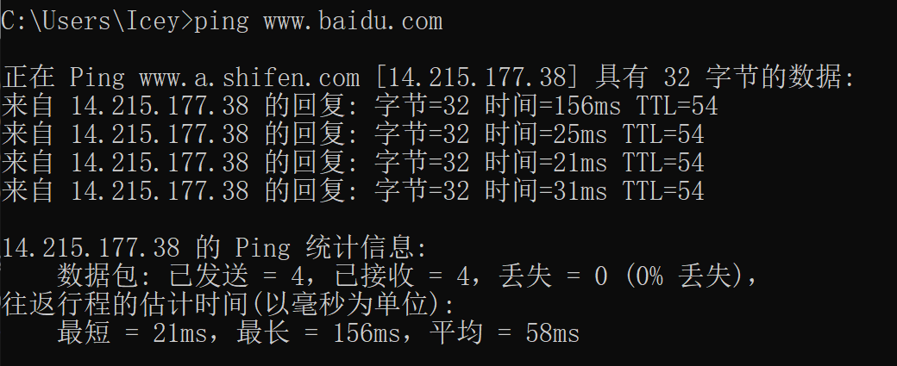

ping这个单词源自声纳定位，而这个程序的作用也确实如此，它利用ICMP协议包来侦测另一个主机是否可达。原理是**用类型码为0的ICMP发请求，受到请求的主机则用类型码为8的ICMP回应**。

ping程序来计算间隔时间，并计算有多少个包被送达。用户就可以判断网络大致的情况。我们可以看到，ping给出来了传送的时间和TTL的数据。

## 五、Traceroute

Traceroute是用来侦测主机到目的主机之间所经路由情况的重要工具，也是最便利的工具。

Traceroute的原理是非常非常的有意思，它收到目的主机的IP后，首先给目的主机发送一个TTL=1的UDP数据包，而经过的第一个路由器收到这个数据包以后，就自动把TTL减1，而TTL变为0以后，路由器就把这个包给抛弃了，并同时产生
一个主机不可达的ICMP数据报给主机。主机收到这个数据报以后再发一个TTL=2的UDP数据报给目的主机，然后刺激第二个路由器给主机发ICMP数据
报。如此往复直到到达目的主机。这样，traceroute就拿到了所有的路由器IP。

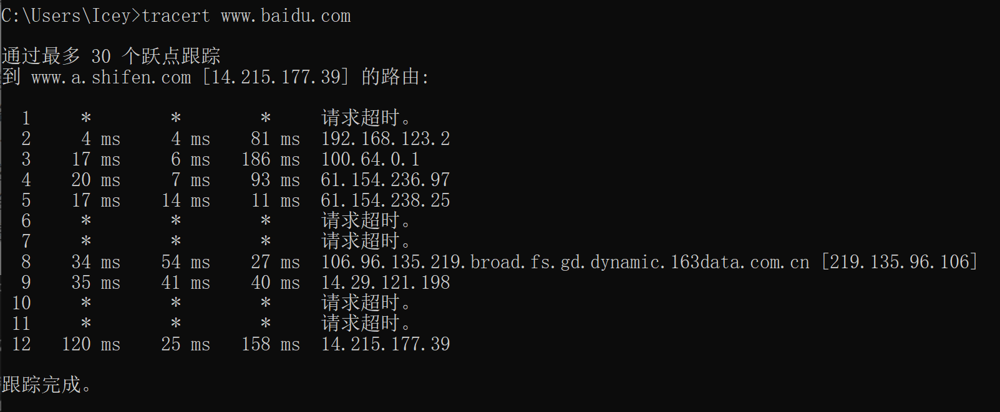

## 六、TCP/UDP

TCP/UDP都是是传输层协议，但是两者具有不同的特性，同时也具有不同的应用场景，下面以图表的形式对比分析。

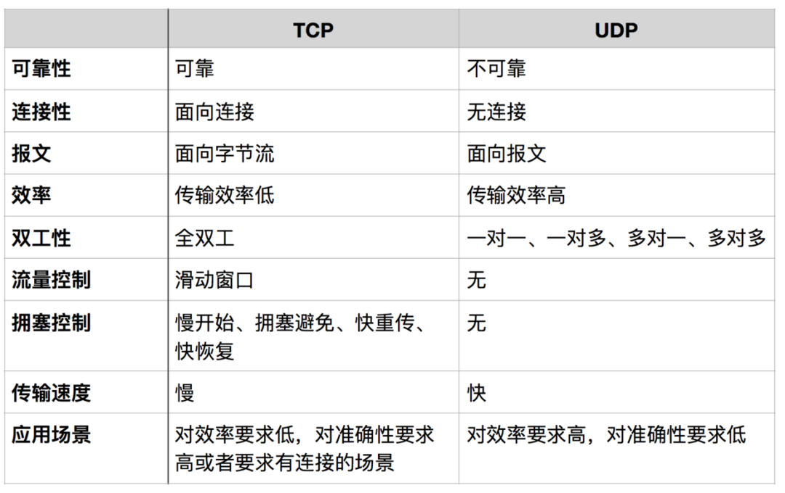

#### 面向报文

面向报文的传输方式是应用层交给UDP多长的报文，UDP就照样发送，即一次发送一个报文。因此，应用程序必须选择合适大小的报文。若报文太长，则IP层需要分片，降低效率。若太短，会是IP太小。

#### 面向字节流

面向字节流的话，虽然应用程序和TCP的交互是一次一个数据块（大小不等），但TCP把应用程序看成是一连串的无结构的字节流。TCP有一个缓冲，当应用程序传送的数据块太长，TCP就可以把它划分短一些再传送。

TCP和UDP协议的一些应用：

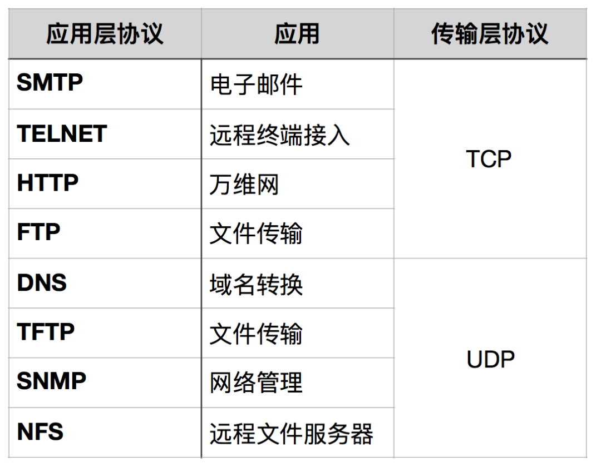

#### 什么时候使用TCP？

当对网络通讯质量有要求的时候，比如：整个数据要准确无误的传递给对方，这往往用于一些要求可靠的应用，比如HTTP、HTTPS、FTP等传输文件的协议，POP、SMTP等邮件传输的协议。

#### 什么时候使用UDP？

当对网络通讯质量要求不高的时候，要求网络通讯速度能尽量的快，这时就可以使用UDP。

## 七、DNS

DNS（Domain Name System，域名系统），因特网上作为域名和IP地址相互映射的一个分布式数据库，能够使用户更方便的访问互联网，而不用去记住能够被机器直接读取的IP数串。通过主机名，最终得到该主机名对应的IP地址的过程叫做域名解析（或主机名解析）。DNS协议运行在UDP协议之上，使用端口号53。

## 八、TCP连接的建立与终止

### 8.1 TCP报文格式简介：


其中比较重要的字段有：

- 序号（sequence number）：Seq序号，占32位，用来标识从TCP源端向目的端发送的字节流，发起方发送数据时对此进行标记。

- 确认号（acknowledgement number）：Ack序号，占32位，只有ACK标志位为1时，确认序号字段才有效，Ack=Seq+1。

- 标志位（Flags）：共6个，即URG、ACK、PSH、RST、SYN、FIN等。具体含义如下：
  - URG：紧急指针（urgent pointer）有效；
  - ACK：确认序号有效；
  - PSH：接收方应该尽快将这个报文交给应用层。
  - RST：重置连接；
  - SYN：发起一个新连接；
  - FIN：释放一个连接；

需要注意的是：不要将确认序号Ack与标志位中的ACK搞混了。确认方Ack=发起方Seq+1，两端配对。

### 8.2 三次握手

TCP是面向连接的，无论哪一方向另一方发送数据之前，都必须先在双方之间建立一条连接。在TCP/IP协议中，TCP协议提供可靠的连接服务，连接是通过三次握手进行初始化的。三次握手的目的是**同步连接双方的序列号和确认号并交换
TCP窗口大小信息**。

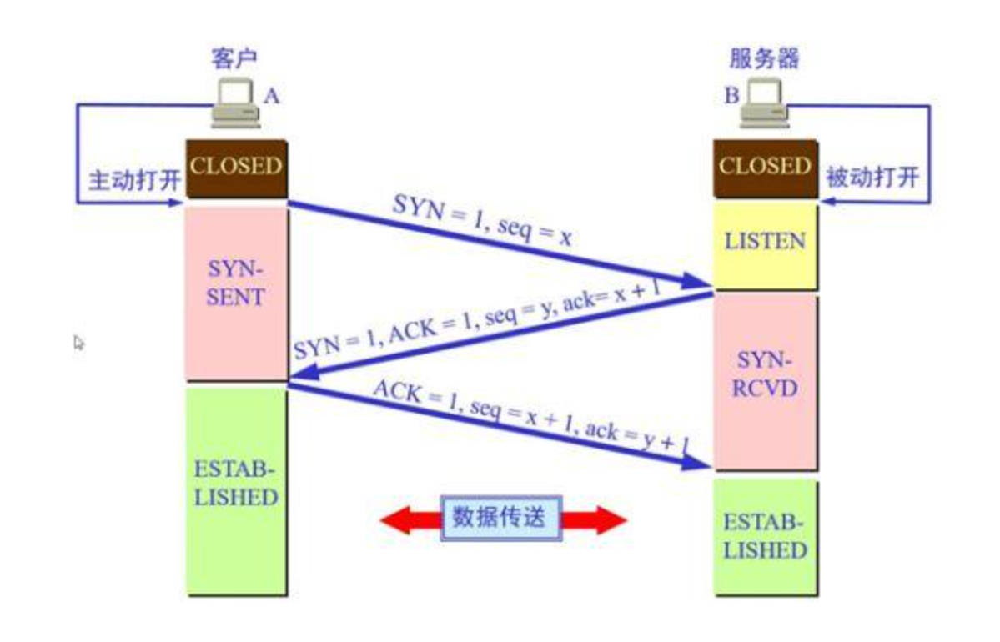

握手之前主动打开连接的客户端结束CLOSED阶段，被动打开的服务器端也结束CLOSED阶段，并进入LISTEN阶段。随后开始“三次握手”：

**第一次握手**：首先客户端向服务器端发送一段TCP报文，其中：

- 标志位为SYN，表示“请求建立新连接”，SYN=1；
- 序号为seq=x（x一般为1）；
- 随后客户端进入SYN-SENT阶段，等待服务端答复。

**第二次握手**：服务端接收到来自客户端的TCP报文后，结束LISTEN阶段，并返回一段TCP报文，其中：

- 标志位为SYN和ACK，表示“确认客户端的报文seq序号有效，服务器能正常接收客户端发送的数据，并同意创建新连接”（即告诉客户端，服务器收到了你的数据）；
- 序号为seq=y；确认号为ack=x+1，表示收到客户端的序号seq并将其值加1作为自己确认号ack的值；随后服务器端进入SYN-RCVD阶段。

**第三次握手**：客户端接收到来自服务器端的确认收到数据的TCP报文之后，明确了从客户端到服务器的数据传输是正常的，结束SYN-SENT阶段。并返回最后一段TCP报文。其中：

- 标志位为ACK，表示“确认收到服务器端同意连接的信号”（即告诉服务器，我知道你收到我发的数据了）；

- 序号为seq=x+1，表示收到服务器端的确认号ack，并将其值作为自己的序号值；

- 确认号为ack=y+1，表示收到服务器端序号seq，并将其值加1作为自己的确认号ack的值；

- 随后客户端进入ESTABLISHED阶段。


服务器收到来自客户端的“确认收到服务器数据”的TCP报文之后，明确了从服务器到客户端的数据传输是正常的。结束SYN-SENT阶段，进入ESTABLISHED阶段。

在客户端与服务器端传输的TCP报文中，双方的确认号ack和序号seq的值，都是在彼此ack和seq值的基础上进行计算的，这样做保证了TCP报文传输的连贯性。一旦出现某一方发出的TCP报文丢失，便无法继续"握手"，以此确保了"三次握手"的顺利完成。

此后客户端和服务器端进行正常的数据传输。这就是“三次握手”的过程。

#### 8.2.1 三次握手动态过程


#### 8.2.2 为什么要进行三次握手

为了防止服务器端开启一些无用的连接增加服务器开销以及防止已失效的连接请求报文段突然又传送到了服务端，因而产生错误。

具体例子：“已失效的连接请求报文段”的产生在这样一种情况下：client发出的第一个连接请求报文段并没有丢失，而是在某个网络结点长时间的滞留了，以致延误到连接释放以后的某个时间才到达server。本来这是一个早已失效的报文段。但server收到此失效的连接请求报文段后，就误认为是client再次发出的一个新的连接请求。于是就向client发出确认报文段，同意建立连接。假设不采用“三次握手”，那么只要server发出确认，新的连接就建立了。由于现在client并没有发出建立连接的请求，因此不会理睬server的确认，也不会向server发送数据。但server却以为新的运输连接已经建立，并一直等待client发来数据。这样，server的很多资源就白白浪费掉了。采用“三次握手”的办法可以防止上述现象发生。例如刚才那种情况，client不会向server的确认发出确认。server由于收不到确认，就知道client并没有要求建立连接。”

### 8.3 四次挥手

所谓的四次挥手即TCP连接的释放(解除)。连接的释放必须是一方主动释放，另一方被动释放。以下为客户端主动发起释放连接的图解：

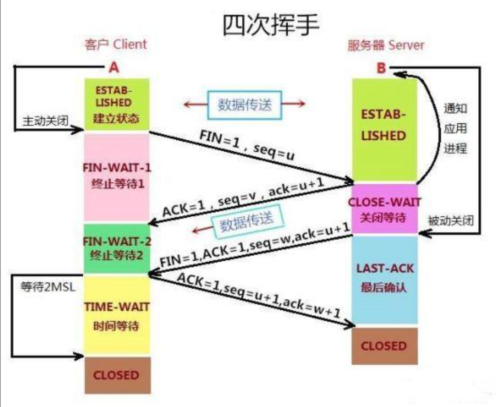

**第一次挥手**：首先客户端想要释放连接，向服务器端发送一段TCP报文，其中：

- 标记位为FIN，表示“请求释放连接“；
- 序号为seq=u；
- 随后客户端进入FIN-WAIT-1阶段，即半关闭阶段。并且停止在客户端到服务器端方向上发送数据，但是客户端仍然能接收从服务器端传输过来的数据；

注意：这里不发送的是正常连接时传输的数据(非确认报文)，而不是一切数据，所以客户端仍然能发送ACK确认报文。

**第二次挥手**：服务器端接收到从客户端发出的TCP报文之后，确认了客户端想要释放连接，随后服务器端结束ESTABLISHED阶段，进入CLOSE-WAIT阶段（半关闭状态）并返回一段TCP报文，其中：

- 标记位为ACK，表示“接收到客户端发送的释放连接的请求”；
- 序号为seq=v；确认号为ack=u+1，表示是在收到客户端报文的基础上，将其序号seq值加1作为本段报文确认号ack的值；
- 随后服务器端开始准备释放服务器端到客户端方向上的连接。客户端收到从服务器端发出的TCP报文之后，确认了服务器收到了客户端发出的释放连接请求，随后客户端结束FIN-WAIT-1阶段，进入FIN-WAIT-2阶段

前"两次挥手"既让服务器端知道了客户端想要释放连接，也让客户端知道了服务器端了解了自己想要释放连接的请求。于是，可以确认关闭客户端到服务器端方向上的连接了

**第三次挥手**：服务器端自从发出ACK确认报文之后，经过CLOSED-WAIT阶段，做好了释放服务器端到客户端方向上的连接准备，再次向客户端发出一段TCP报文，其中：

- 标记位为FIN，ACK，表示“已经准备好释放连接了”。注意：这里的ACK并不是确认收到服务器端报文的确认报文；

- 序号为seq=w；确认号为ack=u+1；表示是在收到客户端报文的基础上，将其序号seq值加1作为本段报文确认号Ack的值。

随后服务器端结束CLOSE-WAIT阶段，进入LAST-ACK阶段。并且停止在服务器端到客户端的方向上发送数据，但是服务器端仍然能够接收从客户端传输过来的数据。

**第四次挥手**：客户端收到从服务器端发出的TCP报文，确认了服务器端已做好释放连接的准备，结束FIN-WAIT-2阶段，进入TIME-WAIT阶段，并向服务器端发送一段报文，其中：

- 标记位为ACK，表示“接收到服务器准备好释放连接的信号”；
- 序号为seq=u+1；表示是在收到了服务器端报文的基础上，将其确认号Ack值作为本段报文序号的值。
- 确认号为ack=w+1；表示是在收到了服务器端报文的基础上，将其序号Seq值作为本段报文确认号的值。随后客户端开始在TIME-WAIT阶段等待2MSL

服务器端收到从客户端发出的TCP报文之后结束LAST-ACK阶段，进入CLOSED阶段。由此正式确认关闭服务器端到客户端方向上的连接。

客户端等待完2MSL之后，结束TIME-WAIT阶段，进入CLOSED阶段，由此完成“四次挥手”。

#### 8.3.1 为什么握手是三次，挥手却要四次

- TCP建立连接时之所以只需要"三次握手"，是因为在第二次"握手"过程中，服务器端发送给客户端的TCP报文是以SYN与ACK作为标志位的。SYN是请求连接标志，表示服务器端同意建立连接；ACK是确认报文，表示告诉客户端，服务器端收到了它的请求报文。即SYN建立连接报文与ACK确认接收报文是在同一次"握手"当中传输的，所以"三次握手"不多也不少，正好让双方明确彼此信息互通。

- TCP释放连接时之所以需要“四次挥手”,是因为FIN释放连接报文与ACK确认接收报文是分别由第二次和第三次"握手"传输的。
- 为何建立连接时一起传输，释放连接时却要分开传输？
  - 建立连接时，被动方服务器端结束CLOSED阶段进入“握手”阶段并不需要任何准备，可以直接返回SYN和ACK报文，开始建立连接。
  - 释放连接时，被动方服务器，突然收到主动方客户端释放连接的请求时并不能立即释放连接，因为还有必要的数据需要处理，所以服务器先返回ACK确认收到报文，经过CLOSE-WAIT阶段准备好释放连接之后，才能返回FIN释放连接报文。

所以是“三次握手”，“四次挥手”。

#### 8.3.2  为什么客户端在TIME-WAIT阶段要等2MSL？

- MSL指的是Maximum Segment Lifetime：一段TCP报文在传输过程中的最大生命周期。

- 2MSL即是服务器端发出为FIN报文和客户端发出的ACK确认报文所能保持有效的最大时长。

原因：为的是确认服务器端是否收到客户端发出的ACK确认报文。

- 当客户端发出最后的ACK确认报文时，并不能确定服务器端能够收到该段报文。所以客户端在发送完ACK确认报文之后，会设置一个时长为2MSL的计时器。

- 服务器端在1MSL内没有收到客户端发出的ACK确认报文，就会再次向客户端发出FIN报文；

- 如果客户端在2MSL内，再次收到了来自服务器端的FIN报文，说明服务器端由于各种原因没有接收到客户端发出的ACK确认报文。客户端再次向服务器端发出ACK确认报文，计时器重置，重新开始2MSL的计时；否则客户端在2MSL内没有再次收到来自服务器端的FIN报文，说明服务器端正常接收了ACK确认报文，客户端可以进入CLOSED阶段，完成“四次挥手”。

- 所以，客户端要经历时长为2SML的TIME-WAIT阶段；这也是为什么客户端比服务器端晚进入CLOSED阶段的原因

## 九、TCP流量控制

- 如果发送方把数据发送得过快，接收方可能会来不及接收，这就会造成数据的丢失。所谓 **流量控制** 就是让发送方的发送速率不要太快，要让接收方来得及接收。

- 利用 **滑动窗口机制** 可以很方便地在TCP连接上实现对发送方的流量控制。

  设A向B发送数据。在连接建立时，B告诉了A：“我的接收窗口是 rwnd = 400”(这里的 rwnd 表示 receiver window)。因此，发送方的发送窗口不能超过接收方给出的接收窗口的数值。

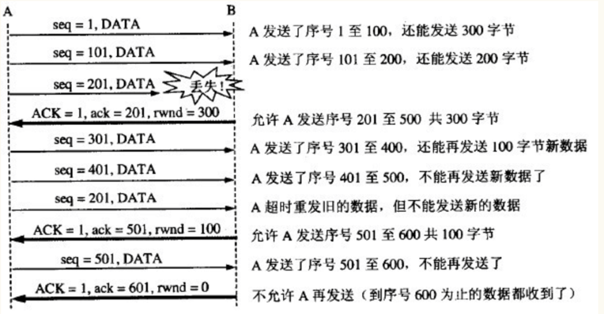

从图中可以看出，B进行了三次流量控制：第一次把窗口减少到 rwnd = 300 ，第二次又减到了 rwnd = 100 ，最后减到 rwnd = 0，即不允许发送方再发送数据了。这种使发送方暂停发送的状态将持续到主机B重新发出一个新的窗口值为止。B向A发送的三个报文段都设置了 ACK = 1，只有在ACK=1时确认号字段才有意义。

TCP为每一个连接设有一个持续计时器(persistence timer)。只要TCP连接的一方收到对方的零窗口通知，就启动持续计时器。若持续计时器设置的时间到期，就发送一个零窗口控测报文段（携1字节的数据），那么收到这个报文段的一方就重新设置持续计时器。

## 十、TCP拥塞控制

### 10.1 慢开始和拥塞避免

发送方维持一个拥塞窗口 cwnd ( congestion window)的状态变量。拥塞窗口的大小取决于网络的拥塞程度，并且动态地在变化。发送方让自己的发送窗口等于拥塞窗口。

发送方控制拥塞窗口的原则是：只要网络没有出现拥塞，拥塞窗口就再增大一些，以便把更多的分组发送出去。但只要网络出现拥塞，拥塞窗口就减小一些，以减少注入到网络中的分组数。

#### 10.1.1 慢开始算法

当主机开始发送数据时，如果立即将大量数据字节注入到网络，那么就有可能引起网络拥塞，因为现在并不清楚网络的负荷情况。 因此，较好的方法是先探测一下，即由小到大逐渐增大发送窗口，也就是说由小到大逐渐增大拥塞窗口数值。

通常在刚刚开始发送报文段时，先把拥塞窗口 cwnd设置为一个最大报文段MSS的数值。而在每收到一个对新的报文段的确认后，把拥塞窗口增加至多一个MSS的数值。用这样的方法逐步增大发送方的拥塞窗口 cwnd，可以使分组注入到网络的速率更加合理。


每经过一个传输轮次，拥塞窗口 cwnd 就加倍。**一个传输轮次所经历的时间其实就是往返时间RTT。** 不过“传输轮次”更加强调：把拥塞窗口cwnd所允许发送的报文段都连续发送出去，并收到了对已发送的最后一个字节的确认。

另外，慢开始的“慢”并不是指cwnd的增长速率慢，而是指在TCP开始发送报文段时先设置cwnd=1，使得发送方在开始时只发送一个报文段（目的是试探一下网络的拥塞情况），然后再逐渐增大cwnd。

为了防止拥塞窗口cwnd增长过大引起网络拥塞，还需要设置一个慢开始门限ssthresh状态变量。慢开始门限ssthresh的用法如下：

- 当 cwnd < ssthresh 时，使用上述的慢开始算法。
- 当 cwnd > ssthresh 时，停止使用慢开始算法而改用拥塞避免算法。
- 当 cwnd = ssthresh 时，既可使用慢开始算法，也可使用拥塞控制避免算法。

#### 10.1.2 拥塞避免

让拥塞窗口cwnd缓慢地增大，即每经过 **一个往返时间RTT** 就把发送方的 **拥塞窗口cwnd加1，而不是加倍**。这样拥塞窗口cwnd按线性规律缓慢增长，比慢开始算法的拥塞窗口增长速率缓慢得多。

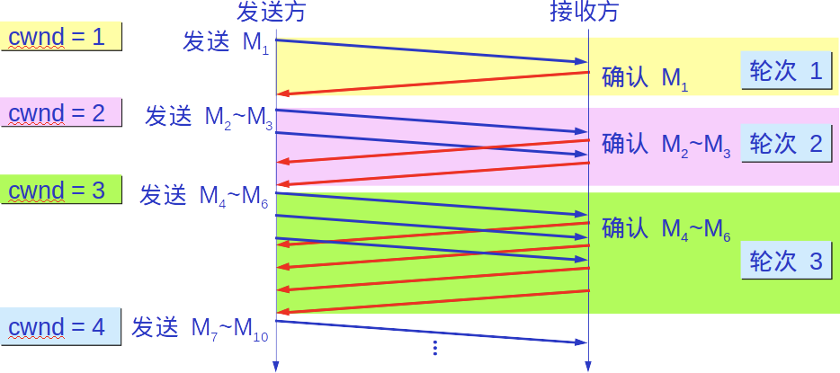

无论在慢开始阶段还是在拥塞避免阶段，只要发送方判断网络出现拥塞（其根据就是没有收到确认），就要把慢开始门限ssthresh设置为出现拥塞时的发送
方窗口值的一半（但不能小于2）。然后把拥塞窗口cwnd重新设置为1，执行慢开始算法。这样做的目的就是要迅速减少主机发送到网络中的分组数，使得发生拥塞的路由器有足够时间把队列中积压的分组处理完毕。

如下图，用具体数值说明了上述拥塞控制的过程。现在发送窗口的大小和拥塞窗口一样大。

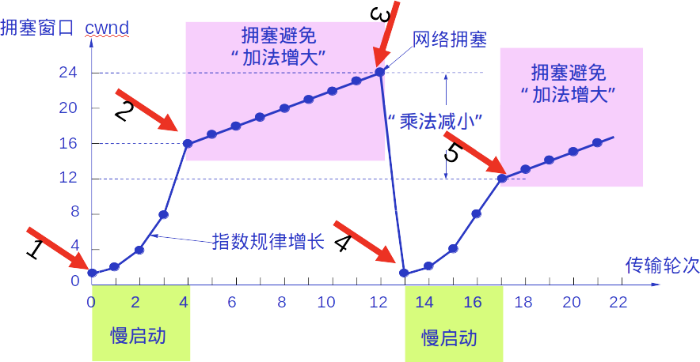

### 10.2 快重传和快恢复

#### 10.2.1 快重传

快重传算法首先要求接收方每收到一个失序的报文段后就立即发出重复确认（为的是使发送方及早知道有报文段没有到达对方）而不要等到自己发送数据时才进行捎带确认。

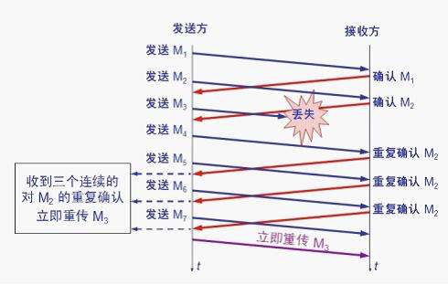

接收方收到了M1和M2后都分别发出了确认。现在假定接收方没有收到M3但接着收到了M4。

显然，接收方不能确认M4，因为M4是收到的失序报文段。根据可靠传输原理，接收方可以什么都不做，也可以在适当时机发送一次对M2的确认。

但按照快重传算法的规定，接收方应及时发送对M2的重复确认，这样做可以让
发送方及早知道报文段M3没有到达接收方。发送方接着发送了M5和M6。接收方收到这两个报文后，也还要再次发出对M2的重复确认。这样，发送方共收到了
接收方的四个对M2的确认，其中后三个都是重复确认。

**快重传算法还规定，发送方只要一连收到三个重复确认就应当立即重传对方尚未收到的报文段M3，而不必 继续等待M3设置的重传计时器到期。**

由于发送方尽早重传未被确认的报文段，因此采用快重传后可以使整个网络吞吐量提高约20%。

#### 10.2.2 快恢复

与快重传配合使用的还有快恢复算法，其过程有以下两个要点：

- 当发送方连续收到三个重复确认，就执行“乘法减小”算法，把慢开始门限ssthresh减半。

- 与慢开始不同之处是现在不执行慢开始算法（即拥塞窗口cwnd现在不设置为1），而是把cwnd值设置为 慢开始门限ssthresh减半后的数值，然后开始执行拥塞避免算法（“加法增大”），使拥塞窗口缓慢地线性增大。 

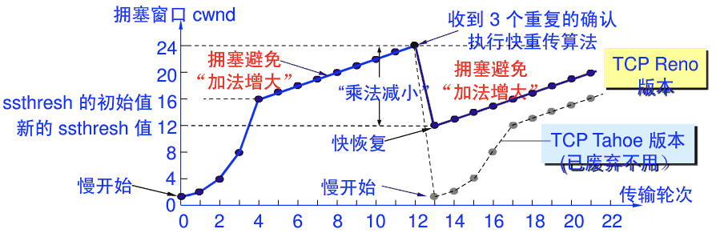