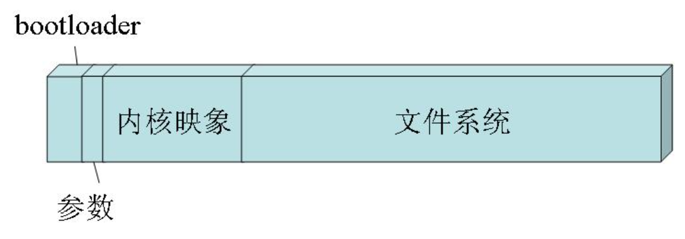

# Linux知识

## 一、嵌入式Linux系统的构成和启动过程

### 1.1 嵌入式系统的构成

上图是一个嵌入式Linux系统的典型结构，划分成了4个区：

- BootLoader区存放的是BootLoader，它负责嵌入式系统最初的硬件初始化、驱动和内核加载。
- 参数区不是必须的，通常存放了一些系统参数，并且通常这个区是没有文件系统，参数以原始数据格式来存放。
- 内核镜像区存放的Linux内核压缩镜像，它被解压后运行与内存，作为嵌入式设备的Linux操作系统。
- 文件系统区存放经过压缩的文件系统，它会被Linux内核解压并挂载，并作为各种应用程序、文件的主要载体。

这4个区都以二进制数据的形式存放于嵌入式设备的Flash芯片上。

### 1.2 嵌入式Linux系统启动过程

嵌入式设备从上电那一刻到应用程序正常运行，其间经历过一系列漫长的过程，下面对主要的步骤进行阐述：

- 嵌入式设备上电后，CPU开始运行，通常CPU会从某一个固定的物理地址开始运行，这个物理地址一般是**Flash芯片的起始物理地址**。Flash芯片的最初一段通常存放的是BootLoader，于是CPU就会开始**运行BootLoader**的代码。
- 我们知道CPU可以读写Flash上的数据，但是不能直接执行Flash上的指令，CPU通常只能执行内存中的指令，那么CPU刚开始运行时怎样去执行Flash上的指令呢？这里分两种情况，Flash芯片主要分为两种，一种是Nor Flash，另一种是Nand Flash，Nor Flash具有可以直接在Flash芯片上执行指令的特点。如果嵌入式设备采用的是Nor Flash，那就比较简单了，CPU可以直接运行在Nor Flash上的指令。如果采用的是Nand Flash呢，怎么办？目前主要有两种方法，一种方法是Flash控制器能够把Nand Flash的前4k数据搬到4k的内部RAM中，并设置CPU从这个内部RAM的起始地址开始启动执行。另一种方法是Flash控制器能够把Nand Flash的前4k数据的地址映射到系统总线的某个地址上，并设定CPU从这个地址开始启动执行。这两种方法都是硬件来完成的。
- Bootloader分为两个部分，第一部分是汇编代码且不做压缩，第二部分是C代码且有压缩的。Bootloader开始执行时，**第一部分汇编代码先负责初始化CPU、PLL、DDR、Cache等硬件，让CPU和内存能够稳定运行，然后解压第二部分的Image，并拷贝到到内存执行。第二部分C代码完成串口、flash、网口等驱动的加载，并构建一个shell环境来接受用户输入。**注意，在整个Bootloader运行其间CPU的MMU是没有被初始化的，所有的地址访问都是采用物理地址直接访问的。
- 在完成Bootloader初始化后，根据代码中设定的内核区物理地址，Bootloader会把内核区压缩后的Linux镜像拷贝到内存中并解压。同时准备好内核的启动参数，如：console=ttyS0,115200 root=31:2 mtdparts=ar7100-nor0:196608(boot),835236(kernel),-(rootfs)，这里主要是把Bootloader里设置的MTD分区信息传递给内核，还有需要加载的根文件系统。最后跳转到内核入口开始运行。
- Linux内核代码开始执行，会先进行内核各个子系统初始化，并完成对MMU的初始化。MMU是CPU中的一个单元，它跟操作系统一起配合完成从虚拟地址到物理地址的转换。如果CPU带有MMU单元，则CPU执行单元发出的内存地址将被MMU截获，从CPU到MMU的地址称为虚拟地址，而MMU将这个地址翻译成另一个地址发到CPU芯片的外部地址引脚上，这个地址称为物理地址。在这个过程中Linux内核会维护页表结构，它保存着内核和进程的虚拟地址到物理地址的映射，而MMU则通过Linux内核页表去完成地址翻译和保护工作。
- 接下来Linux内核会挂载根文件系统，要挂载的根文件系统是通过内核启动参数来获取的。这里有一个问题，根文件系统通常表示为一个Linux文件系统下的某个MTD设备，但在加载根文件系统前Linux还没有一个文件系统，那它怎样通过访问文件系统中的MTD设备来加载根文件系统呢？事实上，根文件系统的安装分为两个阶段，首先Linux内核会安装一个特殊的RootFS文件系统，该文件系统仅提供一个作为初始安装点的空目录，然后Linux内核再在空目录上安装一个真正的根目录。Linux内核对Flash的访问都是通过MTD子系统来进行的，它抽象了对于各种Flash设备的访问，提供统一的接口。
- Linux内核继续初始化各种类型的驱动程序，完成之后会启动第一个应用程序，它的进程ID为1。这个应用程序可以由内核启动参数传入，如果没有则会默认执行/sbin/init。init进程会读取配置文件/etc/inittab，根据配置文件的内容它会完成两个工作，执行rcS和启动Shell。至此，Linux系统已经启动完成，给用户提供了一个Shell的交互环境，后续的行为就取决于用户的输入或者系统特定应用的加载。

