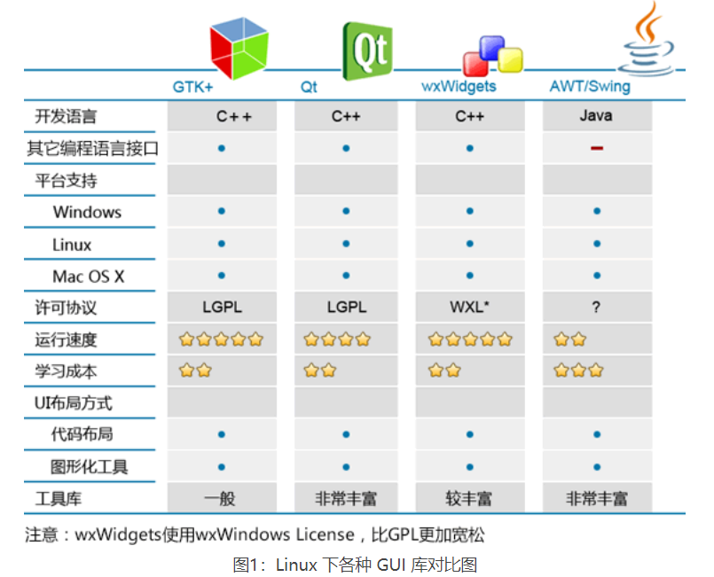
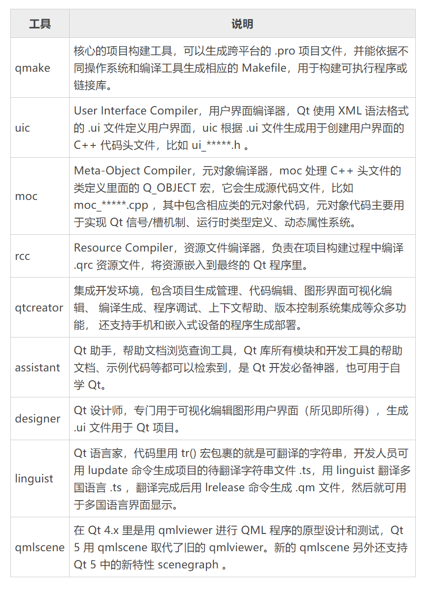
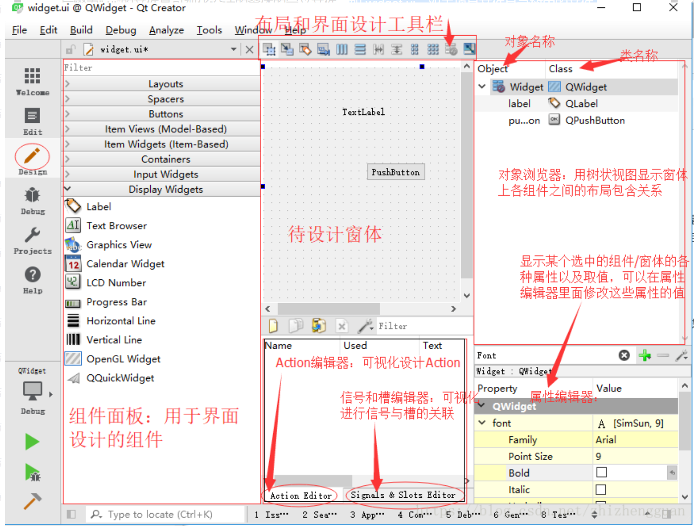

## 一、Qt简介

### 1.1 什么是Qt

Qt是一个跨平台的C++开发库，主要用来开发图形用户界面(GUI)程序，当然也可以开发不带界面的命令行程序。

### 1.2 Qt可以做什么？

Qt除了被当做GUI库，用来开发图形界面应用程序，还包含很多其他功能，比如多线程、访问数据库、图像处理、音视频处理、网络通信、文件操作等。

`Qt主要用于桌面程序开发和嵌入式开发`

### 1.3 Qt的发展

- 1991年 由挪威的Eirik Chambe-Eng 和 Haavard Nord 开发，1994年3月4号成立奇趣科技公司。

- 2008年，诺基亚收购奇趣。

- 2011年3月出售给芬兰IT服务公司Digia，2014年9月宣布成立Qt company全资子公司。

## 二、Qt和其他GUI库的对比

### 2.1 Windows下的GUI库

- 基于C++：Qt、MFC、WTL、wxWidgets、DirectUI、Htmlayout

- 基于C#：WinForm、WPF；

- 基于Java：AWT、Swing；

- 基于Pascal：Delphi；

- 基于Go语言：walk、electron;

  Qt 的优点：

  - 简单易学：封装好，几行代码就可以开发一个简单的客户端；

  - 资料丰富：可降低学习成本；

  - 漂亮的界面：Qt可以做出漂亮的界面和炫酷的动画；

  - 安装独立：Qt程序最终会编译成本地代码、不用其他库的支撑；

  - 跨平台

### 2.2 Linux下的GUI库

- 基于C++：Qt、GTK+、wxWidgets；
- 基于Java：AWT、Swing；



## 三、Qt工具



## 四、Qt项目管理文件(.pro)的作用

项目管理文件主要用于记录项目的一些设置，以及项目包含文件的组织管理。

```
#pro文件内容

QT       += core gui
#表示项目中加入了core gui模块，core gui是Qt用于GUI设计的类库模块、如果
#是创建的控制台（Console）应用程序，就不需要添加。

#Qt类库是以模块的形式组织各类功能的类，根据项目涉及的功能需求，在项目中添加
#适当额类库模块支持。如数据库sql模块。

greaterThan(QT_MAJOR_VERSION, 4): QT += widgets
#这个条件执行语句，表示当Qt主版本大于4时，才加入widgets模块。

TARGET = 01_demo
#表示目标生成的可执行文件的名称，即编译后生成的可执行文件是01_demo.exe。

TEMPLATE = app
#表示项目使用的模板是APP，是一般应用程序。

DEFINES += QT_DEPRECATED_WARNINGS
#定义编译选项，QT_DEPRECATED_WARNINGS表示当Qt的某些功能被标记为已过时
#时，那么编译器会发出警告。

SOURCES += \
        main.cpp \
        widget.cpp
#源文件

HEADERS += \
        widget.h
#头文件
```

## 五、Qt项目界面文件(.ui)



- 组件面板：用于界面设计的组件
- 待设计窗口：如果要将某个组件放到窗口上，直接拖拉组件即可。
- Signal和Slot编辑器与action编辑器位于待设计窗口的下方。
- 工具栏
- 对象浏览器
- 属性编辑器

widget.ui是窗体界面定义文件，是一个XML文件，定义了窗口上的所有组件的属性设置、布局、即信号与槽的关联等。用UI设计器可视化设计的界面都又Qt自动解析，并以XML文件的形式保持下来。界面设计时，只需要在UI设计器里进行可视化设计即可，不管widget.ui文件是怎么生成的。

ui_widget.h是对widget.ui文件编译后自动生成的，widget.ui又是通过UI设计器可视化设计生成的。

```c++
#ifndef UI_WIDGET_H
#define UI_WIDGET_H

#include <QtCore/QVariant>
#include <QtWidgets/QAction>
#include <QtWidgets/QApplication>
#include <QtWidgets/QButtonGroup>
#include <QtWidgets/QHeaderView>
#include <QtWidgets/QLabel>
#include <QtWidgets/QPushButton>
#include <QtWidgets/QWidget>

QT_BEGIN_NAMESPACE

//Ui_Widget类，用于封装可视化设计的界面
class Ui_Widget
{
public:
    //自动生成的组件类成员变量
    QLabel *label;
    QPushButton *pushButton;

    void setupUi(QWidget *Widget)
    {
        if (Widget->objectName().isEmpty())
            Widget->setObjectName(QStringLiteral("Widget"));
        Widget->resize(400, 300);
        label = new QLabel(Widget);
        label->setObjectName(QStringLiteral("label"));
        label->setGeometry(QRect(80, 40, 201, 131));
        QFont font;
        font.setPointSize(13);
        label->setFont(font);
        label->setAlignment(Qt::AlignCenter);
        pushButton = new QPushButton(Widget);
        pushButton->setObjectName(QStringLiteral("pushButton"));
        pushButton->setGeometry(QRect(280, 220, 80, 31));
		//用来设置界面各组件的文字内容属性，如标签的文字、按键的文字、窗体的标题等
        retranslateUi(Widget);
        
        QObject::connect(pushButton, SIGNAL(clicked()), Widget, SLOT(close()));
		//设置槽函数的关联方式，该函数将搜索Widget界面上所以的组件，将信号与槽关联起来。不用手动设置
        QMetaObject::connectSlotsByName(Widget);
    } // setupUi

    void retranslateUi(QWidget *Widget)
    {
        Widget->setWindowTitle(QApplication::translate("Widget", "Widget", Q_NULLPTR));
        label->setText(QApplication::translate("Widget", "Hello world", Q_NULLPTR));
        pushButton->setText(QApplication::translate("Widget", "close", Q_NULLPTR));
    } // retranslateUi

};

namespace Ui {
    class Widget: public Ui_Widget {};
} // namespace Ui

QT_END_NAMESPACE

#endif // UI_WIDGET_H

```

## 六、Qt项目的main函数

```C++
#include "widget.h"
#include <QApplication>

int main(int argc, char *argv[])
{
    QApplication a(argc, argv); //定义并创建应用
    Widget w;  //定义并创建窗口
    w.show();  //显示窗口

    return a.exec();  //应用程序运行，开始应用程序的消息循环和事件处理
}

```

## 七、Qt信号与槽机制

Qt的信号与槽机制，使Qt中处理界面各个组件的交互操作变得简单直观。

信号是在特定情况下被发射的事件，例如pushbutton最常见的信号就是鼠标单击时发射的clicked()信号。

槽是对信号响应的函数。

```c++
QObject::connect(sender, SIGNAL(signal()), receiver, SLOT(slot()));
```

注意点：

- 一个信号可以连接多个槽

- 多个信号可以连接同一个槽；

- 一个信号可以连接另外一个信号；

- 严格情况下，信号和槽的参数个数和类型需要一致，至少信号的参数不能少于槽的参数，如果不匹配，会出现编译错误或运行错误。

- 在使用信号和槽的类中，必须在类的定义中加入宏Q_OBJECT；

- 当一个信号被发射时，与其关联的槽函数通常被立即执行，就像正常调用一个函数一样。

## 八、Qt Creator 使用技巧

| 功能                                                   | 快捷键       | 解释                                                         |
| ------------------------------------------------------ | ------------ | ------------------------------------------------------------ |
| Switch Header/Source                                   | F4           | 在同名的头文件和源文件之间切换                               |
| Follow Symbol Under Cursor                             | F2           | 跟踪光标下的符号，若是变量，可跟踪到变量声明的地方；若是函数体或函数声明，可以在两者之间切换 |
| Switch Between Function<br/>Declaration and Definition | Shift+F2     | 在函数的声明（函数原型）和定义（函数实现）之间切换           |
| Refactor\Rename Symbol Under Cursor                    | Ctrl+Shift+R | 对光标处的符号更改名称，这将替换到所有用到这个符号的地方     |
| Refactor\Add Definition in .cpp                        |              | 为函数原型在cpp文件里生成函数体                              |
| Auto-indent Selection                                  | Ctrl + i     | 为所选择的文字进行自动缩进                                   |
| Toggle Comment Selection                               | Ctrl + /     | 为选择的文字进行注释符号的切换，即可以注释所选代码或取消注释 |
| Context Help                                           | F1           | 为光标所在的符号显示帮助文档的内容                           |
| save all                                               | Ctrl+shift+s | 文件全部保存                                                 |
| Find/Replace                                           | Ctrl + F     | 调出查找或替换框                                             |
| Find next                                              | F3           | 查找下一个                                                   |
| Build                                                  | Ctrl + B     | 编译当前项目                                                 |
| Start Debugging                                        | F5           | 开始调试                                                     |
| Step Over                                              | F10          | 调试状态下单步略过，即执行当前行程序语句                     |
| Step Into                                              | F11          | 调试状态下跟踪进入，即如果当前行里有函数，就跟踪进入函数体   |
| Toggle Breakpoint                                      | F9           | 设置或取消当前行的断点                                       |

## 九、Qt元对象和属性系统详解

Qt是一个用标准C++编写的跨平台开发类库，它对标准C++进行了扩展，引入了元对象系统、信号与槽、属性等特性，使应用程序的开发变得高效。

### 9.1 Qt的元对象系统

Qt的元对象系统提供了对象之间通信的信号与槽机制，运行时类型信息和动态属性系统。

元对象系统由以下三个基础组成：

1、QObject类是所有使用元对象系统的类的基类。

2、在一个类的private部分声明Q_OBJECT宏，使得类可以使用元对象的特性，例如动态属性、信号与槽。

3、MOC（元对象编译器）为每个QObject的子类提供必要的代码来实现元对象系统的特性。

构建项目时，MOC工具读取C++源文件，当它发现类的定义里有Q_OBJECT宏时，它就会为这个类生成另外一个包含有元对象支持代码的C++源文件，这个生成的源文件连同类的实现文件一起被编译和连接。

除了信号与槽机制外，元对象还提供如下一些功能：

- QObject::metaObject()函数，返回类关联的元对象，元对象类QMetaObject 包含了访问元对象的一些函数接口，例如QMetaObject::className() 函数可在运行时返回类的名称字符串。

```C++
QObject *obj = new QPushButton;
obj->metaObject()->className();//返回“QPushButton”
```

- QMetaObject::newInstance() 函数，创建类的一个新的实例
- QObject::inherits(const char *className) 函数，判断一个对象实例是否是名称为className或者QObject的子类实例。


### 9.2 属性系统

Qt 提供一个 Q_PROPERTY() 宏可以定义属性，它也是基于元对象系统实现的。Qt 的属性系统与 C++ 编译器无关，可以用任何标准的 C++ 编译器编译定义了属性的 Qt C++ 程序。

#### 动态属性

QObject::setProperty()函数可以在运行时为类定义一个新的属性，称之为动态属性。动态属性是针对类的实例定义的。

动态属性可以使用 QObject::property() 查询，就如在类定义里用 Q_PROPERTY 宏定义的属性一样。

例如，在数据表编辑界面上，一些字段是必填字段，就可以在初始化界面时为这些字段的关联显示组件定义一个新的 required 属性，并设置值为“true”，如：

```C++
editName->setProperty("required", "true");
comboSex->setProperty("required", "true");
checkAgree->setProperty("required", "true");
```

然后，可以应用下面的样式定义将这种必填字段的背景颜色设置为亮绿色。

```C++
*[required="true"]{background-color:lime}
```

#### 类的附加信息

属性系统还有一个宏 Q_CLASSINFO()，可以为类的元对象定义“名称---值”信息，如：

```C++
class QMyClass:public QObject {
    Q_OBJECT
    Q_CLASSINFO("author", "Icey")
    Q_CLASSINFO ("company", "Intretech")
    Q_CLASSINFO("version ", "0.0.1")
  public:
    ...
};
```

用Q_CLASSINFO宏定义附加类信息后，可以通过元对象的一些函数获取类的附加信息，如classInfo(int)获取某个附加信息。

## 十、Qt顺序容器类和关联容器类

Qt的容器类比标准模板库（STL）中的容器类更轻巧、安全和易于使用。这些容器类是隐式共享和可重入的，而且它们进行了速度和存储优化，因此可以减少可执行文件的大小。此外，它们还是线程安全的，也就是说它们作为只读容器是可以被多个线程访问。

容器类是基于模板的类，如常用的容器类QList<T>，T是一个具体的类型，可以是int、float等简单的类型，也可以是QString、QDate等类，但不能是QObject或任何其他子类。T必须是一个可赋值的类型，即T必须提供一个缺省的构造函数，一个可复制构造函数和一个赋值运算符。

Qt容器类分为顺序容器和关联容器

### 10.1 顺序容器

Qt的顺序容器类有QList、QLinkedList、QVector、QStack和QQueue。

#### QList

QList是最常用的容器类，虽然它是以`数组`列表的形式实现的，但是在其前后添加数据非常快，QList以下标索引的方式对数据进行访问。

QList用于添加、插入、替换、移动、删除数据项的函数，有：insert()、replace()、removeAt()、move()、swap()、append()、prepend()、removeFirst() 和 removeLast() 等。

QList提供下标索引方式访问数据项，如同数组一样，也提供at()函数，例如：

```C++
QList<QString>list;
list<<"one"<<"two"<<"three";
QString str1 = list[1];//str1 == "two"
QString str2 = list.at(0);str0 == "one"
```

QList的isEmpty()函数在数据项为空时返回true，size()函数返回数据项的个数。

QList是Qt中最常用的容器类，很多函数的参数传递都是采用QList容器类。

#### QLinkList

QLinkList<T>是链式列表，数据项不是用连续的内存存储的（不能使用下标索引访问数据项），它基于迭代器访问数据项，并且插入和删除数据项的操作时间相同。

#### QVector

QVector<T>提供动态数组的功能，以下标索引访问数据。

QVector的函数接口与QList几乎完全相同，QVector的性能比QList更高，因为QVector的数据项是连续存储的。

#### QStack

QStack是提供类似基于堆栈的先进后出操作的容器类，push()和pop()是主要的接口函数。

#### QQueue

QQueue<T>是提供类似于队列的先进先出操作的容器。enqueue()和dequeue()的主要操作函数。

### 10.2 关联容器

Qt还提供关联容器类QMap、QMultiMap、QHash、QMUltiHash和QSet。

## 十一、Qt类库模板划分详解

Qt类库中大量的类根据功能分为各种模块，这些模块可以分成以下几个类：

- Qt基本模块：提供Qt在所有平台上的基本功能；
- Qt附加模块：实现一些特定功能的提供附加价值的模块。
- 增值模块：单独发布的提供额外价值的模块或工具。
- 技术预览模块：一些处于开发阶段，但是可以作为技术预览使用的模块。
- Qt工具：帮助应用程序开发的一些工具。

### 11.1 基本模块

| 模块                  | 描述                                             |
| --------------------- | ------------------------------------------------ |
| Qt Core               | 其他模块都用到的核心非图形类                     |
| Qt GUI                | 设计GUI界面的基础类，包括OpenGL                  |
| Qt Multimedia         | 音频、视频、摄像头和广播功能的类                 |
| Qt Multimedia Widgets | 实现多媒体功能的界面组件类                       |
| Qt Network            | 使网络编程更简单和轻便的类                       |
| Qt QML                | 用于QML和JavaScript语言的类                      |
| Qt Quick              | 用于构建具有定制用户界面的动态应用程序的声明框架 |
| Qt Quick Controls     | 创建桌面样式用户界面，                           |
| Qt Quick Dialogs      | 用于Qt Quick的系统对话框类型                     |
| Qt Quick Layouts      | 用于Qt Quick 2界面元素的布局项                   |
| Qt SQL                | 使用SQL                                          |
|                       |                                                  |
|                       |                                                  |

