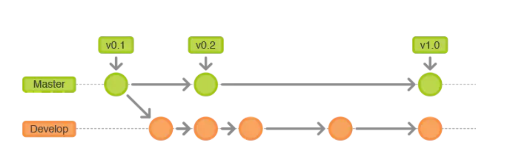
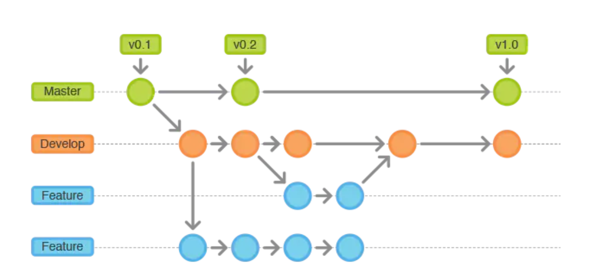
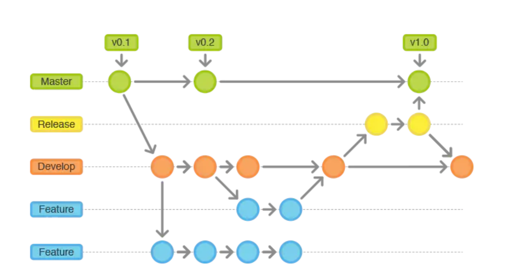
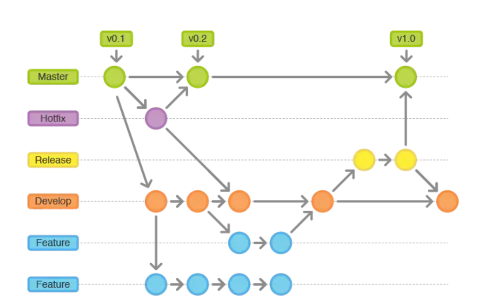

# gitflow


gitflow是一个Git版本管理的流程和规范。

## 一、Git Flow的常用分支

- **Production分支**

  也叫master分支，这个分支最近发布到生产环境的代码，最近发布的Release，这个分支只能从其他分支合并，不能在这个分支直接修改。

- **Develop分支**

  这个分支是我们用来开发的主要分支，包含所有要发布到release的代码，这个主要合并与其他分支，如Feature分支。

- **Feature分支**

  这个分支主要用来开发一个新的功能，一旦开发完成，我们合并回Develop分支，进入下一个release

- **Release分支**

  当需要一个新release的时候，我们基于develop分支创建一个release分支，完成release后，我们合并到master和develop分支

- **Hotfix分支**

  当我们在production发现新的bug时，我们需要创建一个hotfix，完成hotfix后，我们合并会master和develop分支，所以hotfix的改动会进入下一个release。

## 二、Git Flow如何使用

- **Master/Develop分支**

  所有在master分支上的commit应该打上tag，一般情况下，master不存在commit，develop分支基于master分支创建。



- **Feature分支**

  feature分支座位后，必须合并回develop分支，合并完分支后一般会删除这个feature分支，毕竟保留下来的意义不大。



- **Release分支**

  release分支基于develop分支创建，打完release分支之后，我们可以在这个release分支上测试和修改bug等，同时，其他开发人员可以基于develop分支创建新的feature分支，（记住：一旦打了release分支之后，不要从develop分支上合并新的改动到release分支），发布release分支时，合并release到master分支和develop，同时在master分支上打个tag记住release版本号，然后可以删除release分支了

  

- Hotfix分支

  hotfix分支基于master分支创建，开发完后需要合并回master和develop分支，同时在master上打一个tag。

  

## Git Flow命令示例

**创建develop**

```bash
git branch develop
git push -u origin develop
```

**开始Feature**

```bash
#通过develop新建feature分支
git checkout -b feature develop

#推送至远程服务器
git push -u origin feature

#修改文件
git statu
git add .
git commit
```

**完成Feature**

```bash
git pull origin develop
git checkout develop

#--no-ff:不使用fast-forward方式合并，保留分支的commit历史
#--squash:使用squash方式合并，把多次分支commit历史压缩为一次

git merge --no-ff feature
git push origin develop
#删除分支
git branch -D feature
#如果需要删除远程feature分支
git push origin --delete feature
```

**开始release**

```bash
git checkout -b release-0.1 develop
```

**完成release**

```bash
git checkout master
git merge --no-ff release-0.1
git push origin master

git checkout develop
git merge --no-ff release-0.1
git push origin develop

git branch -d release-0.1
git push origin --delete release-0.1

# 合并master/develop分支之后，打上tag
git tag -a V0.1 master
git push --tags
```

**开始hotfix**

```bash
git checkout -b hotfix-0.2 master
```

**完成hotfix**

```bash
git checkout master
git merge --no-ff hotfix-0.2
git push 

git checkout develop
git merge --no-ff hotfix-0.2
git push

git branch -d hotfix-0.2
git push origin --delete hotfix-0.2

git tag -a v0.2 master
git push --tag
```

