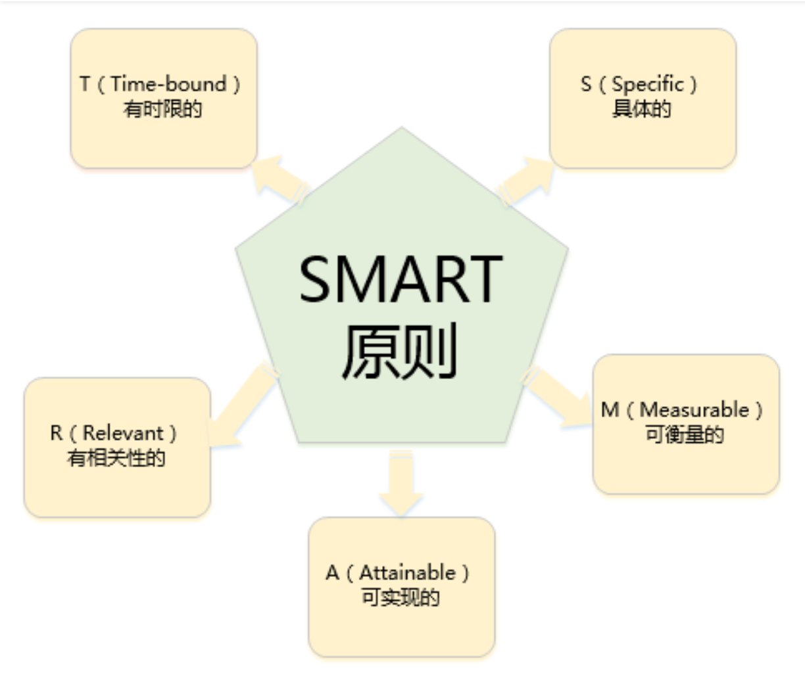

## SMART法则

- S  specific 具体的

  用具体的语言清除地说明要达成的目标。明确的目标几乎是所有成功团队的一致特点。

- M measurable 可衡量的

  目标可用一组明确的数据作为衡量是否达成目标的依据。如果制定的目标没有办法衡量，就无法判断这个目标是否实现。

- A attainable 可实现的

  目标是能够被执行人所接受的

- R relevant 有相关性的

  实现此目标与其他目标要有关联，不能跑题

- T  time-bound 有时限性的

  目标有时间限制。