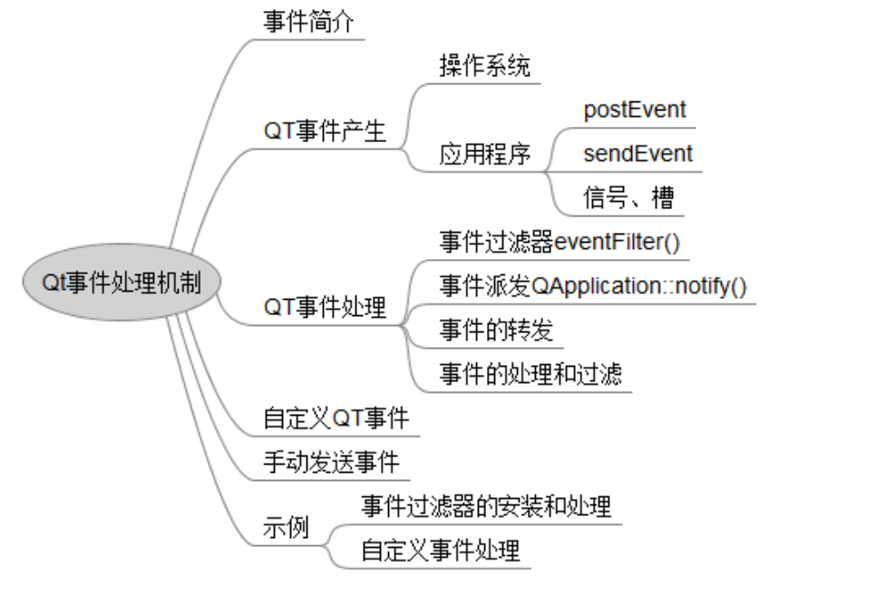

## 一、面板项目

#### 1、什么是flythingsUI框架？

Flythings OS是深圳中科世为公司基于Linux深度裁剪的一个小型的嵌入式操作系统，在Linux系统的基础上开发一套flythings应用开发框架，来实现一个带人机界面的操作系统。应用开发环境是基于Eclipse平台二次开发的，集GUI界面和逻辑代码开发、调试为一体的集成开发环境。flytings 框架的特点是，界面文件主要由三部分组成，在ftu界面文件中拖拉控件来自定义界面，编译后会自动生成logic.cc和activity文件，activity主要是控件的声明和绑定关系，开发人员logic.cc中进行开发。

#### 2、用到哪些设计模式？

**单例模式**：业务线程管理类、WiFi管理类、网关管理类采用的是单例类设计模式，因为在程序的整个运行中都都只需要一类对象存在。

懒汉模式：加锁、内部静态变量来保证线程安全

饿汉模式：线程安全

**简单工厂模式**：设备配置这块我采用的是简单工厂模式来设计，面板可通过APP来配置不同的列表，如灯光、窗帘、空调，配置什么设备就是什么面板，因此设备管理类也采用了工厂模式，根据不同的参数返回灯光类、窗帘类等的实例，这些实例都是设备类的子类。

**监听者模式**：监听者模式通过内部类来实现，线程管理类使用监听者模式来设计，主线程界面跳转时，跳转到新的界面重新注册监听者

**状态机模式**：配网过程和数据同步过程会有很多步骤，在这个过程中会出现很多异常情况，断网、断网关、网关发送了多条消息，此时在什么状态下应该处理哪个事件，忽略那些事件，这些都要进行管控，因此使用状态机的方式来设计。

#### 3、TCP/IP + socket通信

通信过程中数据量较大时，容易出现粘包现象，数据包采用包头+数据的结构，包头中包含包长、包号和类型，使用包长来裁剪。

TCP建立连接的过程

#### 4、多线程

互斥锁

信号量	

## 二、智慧农场管理平台

#### 1、嵌入式系统的启动过程

嵌入式设备从上电那一刻到应用程序正常运行，其间经历过一系列漫长的过程，下面对主要的步骤进行阐述：

- 嵌入式设备上电后，CPU开始运行，通常CPU会从某一个固定的物理地址开始运行，这个物理地址一般是**Flash芯片的起始物理地址**。Flash芯片的最初一段通常存放的是BootLoader，于是CPU就会开始**运行BootLoader**的代码。
- 我们知道CPU可以读写Flash上的数据，但是不能直接执行Flash上的指令，CPU通常只能执行内存中的指令，那么CPU刚开始运行时怎样去执行Flash上的指令呢？这里分两种情况，Flash芯片主要分为两种，一种是Nor Flash，另一种是Nand Flash，Nor Flash具有可以直接在Flash芯片上执行指令的特点。如果嵌入式设备采用的是Nor Flash，那就比较简单了，CPU可以直接运行在Nor Flash上的指令。如果采用的是Nand Flash呢，怎么办？目前主要有两种方法，一种方法是Flash控制器能够把Nand Flash的前4k数据搬到4k的内部RAM中，并设置CPU从这个内部RAM的起始地址开始启动执行。另一种方法是Flash控制器能够把Nand Flash的前4k数据的地址映射到系统总线的某个地址上，并设定CPU从这个地址开始启动执行。这两种方法都是硬件来完成的。
- Bootloader分为两个部分，第一部分是汇编代码且不做压缩，第二部分是C代码且有压缩的。Bootloader开始执行时，**第一部分汇编代码先负责初始化CPU、PLL、DDR、Cache等硬件，让CPU和内存能够稳定运行，然后解压第二部分的Image，并拷贝到到内存执行。第二部分C代码完成串口、flash、网口等驱动的加载，并构建一个shell环境来接受用户输入。**注意，在整个Bootloader运行其间CPU的MMU是没有被初始化的，所有的地址访问都是采用物理地址直接访问的。
- 在完成Bootloader初始化后，根据代码中设定的内核区物理地址，Bootloader会把内核区压缩后的Linux镜像拷贝到内存中并解压。同时准备好内核的启动参数，如：console=ttyS0,115200 root=31:2 mtdparts=ar7100-nor0:196608(boot),835236(kernel),-(rootfs)，这里主要是把Bootloader里设置的MTD分区信息传递给内核，还有需要加载的根文件系统。最后跳转到内核入口开始运行。
- Linux内核代码开始执行，会先进行内核各个子系统初始化，并完成对MMU的初始化。MMU是CPU中的一个单元，它跟操作系统一起配合完成从虚拟地址到物理地址的转换。如果CPU带有MMU单元，则CPU执行单元发出的内存地址将被MMU截获，从CPU到MMU的地址称为虚拟地址，而MMU将这个地址翻译成另一个地址发到CPU芯片的外部地址引脚上，这个地址称为物理地址。在这个过程中Linux内核会维护页表结构，它保存着内核和进程的虚拟地址到物理地址的映射，而MMU则通过Linux内核页表去完成地址翻译和保护工作。
- 接下来Linux内核会挂载根文件系统，要挂载的根文件系统是通过内核启动参数来获取的。这里有一个问题，根文件系统通常表示为一个Linux文件系统下的某个MTD设备，但在加载根文件系统前Linux还没有一个文件系统，那它怎样通过访问文件系统中的MTD设备来加载根文件系统呢？事实上，根文件系统的安装分为两个阶段，首先Linux内核会安装一个特殊的RootFS文件系统，该文件系统仅提供一个作为初始安装点的空目录，然后Linux内核再在空目录上安装一个真正的根目录。Linux内核对Flash的访问都是通过MTD子系统来进行的，它抽象了对于各种Flash设备的访问，提供统一的接口。
- Linux内核继续初始化各种类型的驱动程序，完成之后会启动第一个应用程序，它的进程ID为1。这个应用程序可以由内核启动参数传入，如果没有则会默认执行/sbin/init。init进程会读取配置文件/etc/inittab，根据配置文件的内容它会完成两个工作，执行rcS和启动Shell。至此，Linux系统已经启动完成，给用户提供了一个Shell的交互环境，后续的行为就取决于用户的输入或者系统特定应用的加载。

#### 2、如何交叉编译

- 首先要安装相应版本的qmake编译器，将源码拷贝到系统中，使用“./build-all”进行编译，完成后会生成qmake编译器
- 在源码文件夹中执行qmake进编译
- 生成Makefile后，在执行make，最终生成可执行文件

#### 3、信号与槽的原理

#### 4、QSS样式

#### 5、Qt网络编程

Tcp通信过程

服务端：

- 创建套接字

- 给套接字设置监听

- 如果有连接进来，监听的套接字会发出信号newconnect

- 接收连接，通过nextPendingConnected()函数，返回一个QTCPSocket类型的套接字对象（用于通信）

- 使用用于通信的套接字对象通信。
  - 发送数据：write
  - 接收数据：readALL/read

客户端：

- 创建用于通信的套接字；

- 连接服务器：connectToHost

- 连接成功与服务器通信
  - 发送数据：write
  - 接收数据：readAll/read

#### 6、驱动

## 三、视频播放器

#### 1、布局管理器

水平布局、垂直布局、栅格布局。

在做界面布局的时候使用栅格布局管理器做整体框架设计，然后在其中填充一些水平或垂直布局管理器或者其他组合，可以达到更好的效果

addWidget();

setLayout();

#### 2、FFmpeg

FFmpeg是一套可以用来记录、转换数字音频、视频，并能将其转化为流的开源计算机程序。它包括了目前领先的音/视频编码库libavcodec。

#### 3、RTSP协议

实时流传输协议，

#### 4、音视频同步

## 四、飞机大战游戏

#### 1、事件机制

Qt程序是有事件驱动的，程序的每个动作都是由内部的某个事件所触发。Qt事件的发生和处理成为程序运行的主线，存在于程序的整个生命周期。

常见的事件：键盘事件、鼠标事件、拖放事件、滚轮事件、绘画事件、定时事件等等

事件过滤器是Qt中一个独特的事件处理机制, 功能强大而且使用起来灵活方便。通过事件过滤器, 可以让一个对象侦听拦截另外一个对象的事件。

#### 2、Qt Graphics

#### 3、数据库操作