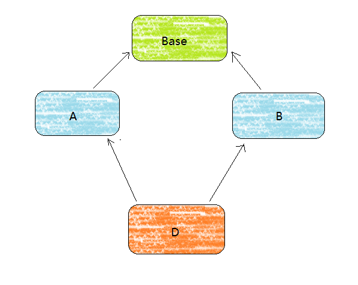
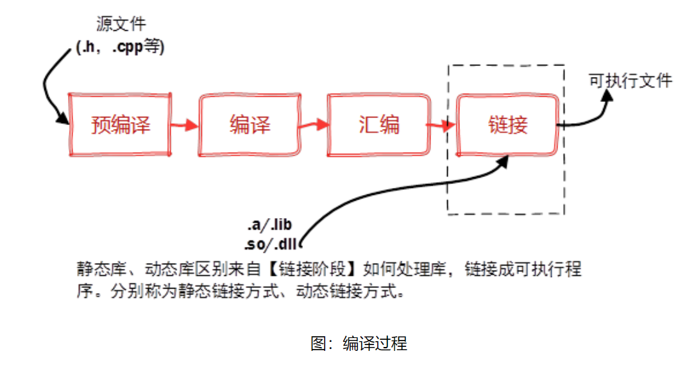

### 1、const、static作用。

**const作用：**

- const修饰变量，说明这个变量不可以被改变；
- const修饰指针，有指针常量和常量指针
  - 指针常量 int * const p = &a; ,这个实质上是个常量，指针在定义时要赋值，指针所指向的地址不可以被改变，而*p的内容可以改变。
  - 常量指针 const int *P；，为指向常量的指针，可以改变指针所指向的地址，但不可以改变常量的值。
- const修饰引用，作为形参时，避免了被函数修改
- const修饰成员函数，该函数不可以修改成员变量

**static 作用：**

- static修饰全局变量，则该全局变量只能在当前源文件中使用
- static修饰函数，则该函数只作用于当前文件
- static修饰局部变量时，该局部变量不会随函数的结束而销毁；
- static修饰成员变量时，该成员变量为所以该类的对象共享使用
- static修饰成员函数时，该函数只能操作static成员变量、全局变量和形参。

### 2、c++面向对象三大特征及对他们的理解，引出多态实现原理、动态绑定、菱形继承。

- 封装：将一类或一种对象的行为和属性组合起来，隐藏属性和行为的实现过程，对外开放公共的访问方式，防止数据被随意修改。

- 继承：通过扩展一个已有的类，并继承该类的全部属性和行为来创建一个新的类。

- 多态：不同的对象收到相同的消息产生不同的动作。

**多态的实现原理**：程序运行后多态是通过继承和虚函数来实现的。

**动态绑定**：带有虚函数的类，编译器编译时会额外分配一个虚函数表，该虚函数表的实质是一个指针数组，存放的是每一个虚函数的入口地址。对于一个派生类来说，他会继承基类的虚函数表，同时增加自己的虚函数入口地址，如果派生类重写了基类的虚函数的话，那么继承过来的虚函数入口地址将被派生类的重写得虚函数入口地址代替，那么**在程序运行时会发生动态绑定，将父类指针绑定到实例化的对象实现多态。**

**菱形继承**：多个类继承了同一公共基类，而这些派生类又同时被一个类继承，如图：

当D的对象要调用base中的函数时，会产生调用不明确的问题，出现数据冗余。解决办法：域限定和虚继承。

### 3、虚析构的必要性，引出内存泄漏，虚函数和普通成员函数的储存位置，虚函数表、虚函数表指针。

在实现多态时，当基类对象操作派生类对象，在使用虚析构函数可以防止只析构基类而不析构派生类的情况发生，避免造成内存泄漏。

### 4、malloc、free和new、delete区别，引出malloc申请空间失败怎么办。

- malloc和free是库函数，new和delete是运算符

- malloc可以开辟指定大小的空间，但不会初始化，new可以调用构造函数，delete调用析构函数
- malloc函数返回的是void *，需要强制转化；new是强制转化类型的。

malloc申请空间失败时，要查看上一个malloc使用的地方，使用错误导致内存出错

### 5、stl熟悉吗，vector、map、list、hashMap，vector底层，map引出红黑树。优先队列用过吗，使用的场景。

STL 是一个标准模板库，使用模板实现了很多数据结构和算法

- vector底层实现是顺序表（数组），list为双向链表，deque为循环队列，map和set为红黑树，hash_set为哈希表。

优先队列中，元素被赋予了 优先级，当访问元素时，具有最高优先级的元素最先出队。

如会员用户优先普通用户

### 6、实现擅长的排序，说出原理（快排、堆排）

冒泡排序：使用两两比较的方式，较大的往后移，一轮后最大的数值排在了最后，以此类推

选择排序：选择序列中最小的一个数值排在最前面，作为已排序列，然后在剩下的序列中选出一个最小的数值排在已排序列的最后面，以此类推。

插入排序：把第一个数值当做已排序列，把剩下的序列一个个插入在已排序列中，

快速排序：采用分治策略，选择一个基准，把比基准小的数值排在左边，比基准大的排在右边，产生两个序列，再重复操作。

希尔排序

### 7、四种cast，智能指针

### 8、tcp和udp区别

### 9、进程和线程区别。

定义：

- 进程是具有一定独立功能的程序关于某个数据集合上的一个运行活动。进程是系统进行资源分配和调度的一个独立的单位。
- 线程是进程的一个实体，是CPU调度和分派的基本单位。它是比进程更小的能独立运行的基本单位。线程自己基本上不拥有系统资源，只拥有一点在运行中必不可少的资源（如程序计数器，一组寄存器和栈），但是它可与同属一个进程的其他线程共享进程拥有的全部资源。

关系：

- 一个线程可以创建和撤销另一个线程；
- 同一个进程中的多个线程之间可以并发执行。

区别：

- 进程和线程的主要差别在于它们是不同的操作系统资源管理方式。
- 进程有独立的地址空间

### 10、指针和引用作用以及区别。

指针是一个变量类型，指针类型的变用来存储一个地址；

引用是一个变量的别名，

### 11、c++11用过哪些特性。

### 12、boost用过哪些类，thread、asio、signal、bind、function

### 13、单例、工厂模式。

### 14、QT信号槽实现机制，QT内存管理。

### 15、进程间通信。会选一个详细问。

### 16、多线程，锁和信号量，互斥和同步。

### 17、动态库和静态库的区别。

所谓静态、动态是指链接。将一个程序编译成可执行程序的步骤：

**静态库**：

在链接阶段，会将汇编生成的目标文件.o与引用到的库一起链接打包到可执行文件中，因此对应的链接方式称为静态链接。

特点：

- 静态库对函数库的链接是放在编译时期完成的。
- 程序在运行的时候与函数库再无瓜葛，移植方便；
- 会浪费空间和资源，因为所有相关的目标文件与牵涉到的函数库被链接合成一个可执行文件。

**动态库**：

动态库在程序编译时并不会被链接到可执行程序中，而是程序运行时才被载入。不同的应用程序如果调用相同的库，那么内存里只需要有一份共享库的实例，避免空间浪费。

特点：

- 动态库把对一些库函数的链接载入推迟到程序运行的时期。

- 可以实现进程之间的资源共享。（因此动态库也称为共享库）

- 将一些程序升级变得简单。

- 甚至可以真正做到链接载入完全由程序员在程序代码中控制（**显示调用**）。

  Window与Linux执行文件格式不同，在创建动态库的时候有一些差异。

- 在Windows系统下的执行文件格式是PE格式，动态库需要一个**DllMain函数做出初始化的入口，通常在导出函数的声明时需要有_declspec(dllexport)关键字**。

- Linux下gcc编译的执行文件默认是ELF格式，**不需要初始化入口，亦不需要函数做特别的声明，**编写比较方便。

与创建静态库不同的是，不需要打包工具（ar、lib.exe），直接使用编译器即可创建动态库。

Windows：.lib静态库，.dll动态库

Linux：.a静态库，.so动态库

